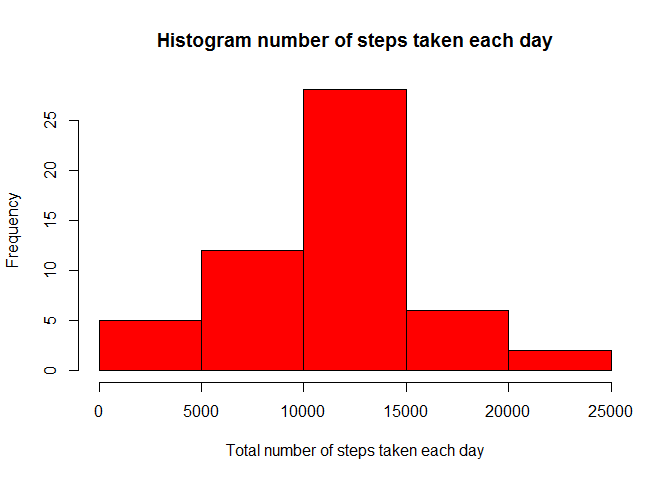
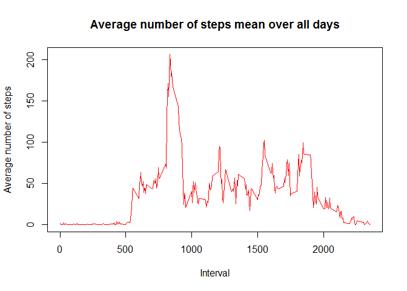
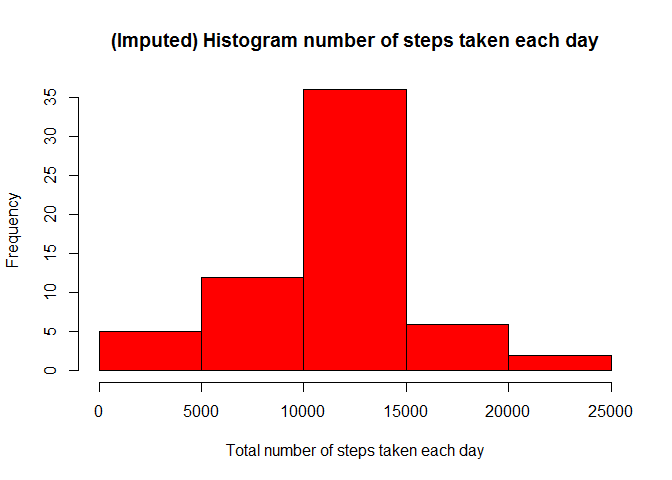
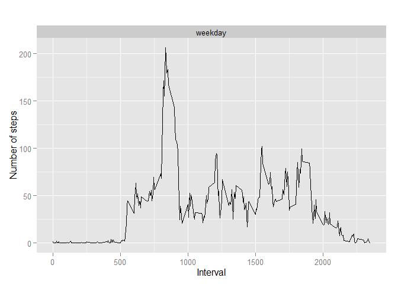

# Reproducible Research: Peer Assessment 1


## Loading and preprocessing the data

Read activity.csv had been extract at local directory


```r
read_df <- read.csv("activity.csv", header = T, sep = ",")
```

set date format `"%Y-%m-%d"`


```r
read_df$date <- as.Date(read_df$date, format = "%Y-%m-%d")
```
## What is mean total number of steps taken per day?

**Agregate** by total steps and day with naming column **'Steps' and 'Date'**


```r
#act.day <- aggregate(read_df$steps, by = list(read_df$date), sum )
act.day <- aggregate(steps ~ date, read_df, sum)
head(act.day)
```

```
##         date steps
## 1 2012-10-02   126
## 2 2012-10-03 11352
## 3 2012-10-04 12116
## 4 2012-10-05 13294
## 5 2012-10-06 15420
## 6 2012-10-07 11015
```

```r
names(act.day)[2] <- "Steps"
names(act.day)[1] <- "Date"
head(act.day)
```

```
##         Date Steps
## 1 2012-10-02   126
## 2 2012-10-03 11352
## 3 2012-10-04 12116
## 4 2012-10-05 13294
## 5 2012-10-06 15420
## 6 2012-10-07 11015
```
**Histogram total number of step per day**


```r
hist(act.day$Steps, col = 2, main = "Histogram number of steps taken each day", xlab = "Total number of steps taken each day")
```

 

**Calculate mean and median of the total number of steps taken per day**

```r
mean(act.day$Steps)
```

```
## [1] 10766.19
```

```r
median(act.day$Steps)
```

```
## [1] 10765
```

## What is the average daily activity pattern?

Make a time series plot (i.e. type = "l") of the 5-minute interval (x-axis) and the average number of steps taken, averaged across all days (y-axis)


```r
act.interval <- aggregate(steps ~ interval, read_df, mean)
head(act.interval)
```

```
##   interval     steps
## 1        0 1.7169811
## 2        5 0.3396226
## 3       10 0.1320755
## 4       15 0.1509434
## 5       20 0.0754717
## 6       25 2.0943396
```

```r
names(act.interval)[2] <- "Steps"
names(act.interval)[1] <- "Interval"
head(act.interval)
```

```
##   Interval     Steps
## 1        0 1.7169811
## 2        5 0.3396226
## 3       10 0.1320755
## 4       15 0.1509434
## 5       20 0.0754717
## 6       25 2.0943396
```

```r
plot(act.interval$Interval, act.interval$Steps, type='l', col=2, 
     main="Average number of steps mean over all days", xlab="Interval", 
     ylab="Average number of steps")
```

 

Find which 5-minute interval, on average across all the days in the dataset, contains the maximum number of steps


```r
#find row number that has maximum average number of steps in an interval
row_number <- which.max(act.interval$Steps)
row_number
```

```
## [1] 104
```

```r
#Get data from row number base on 'row_number'
table_interval_steps <- act.interval[row_number,]
table_interval_steps
```

```
##     Interval    Steps
## 104      835 206.1698
```

## Imputing missing values


```r
#calculate NA 
read_NA <- sum(is.na(read_df$steps))
read_NA
```

```
## [1] 2304
```

```r
# perform the imputation
for (i in 1:nrow(read_df)){
  if (is.na(read_df$steps[i])){
    interval_val <- read_df$interval[i]
    row_id <- which(act.interval$Interval == interval_val)
    steps_val <- act.interval$Steps[row_id]
    read_df$steps[i] <- steps_val
  }
}

# Agregate by total steps and day with  NA imputation 'new dataset "act.day.imputed"' 
act.day.imputed <- aggregate(steps ~ date, read_df, sum)
head(act.day.imputed)
```

```
##         date    steps
## 1 2012-10-01 10766.19
## 2 2012-10-02   126.00
## 3 2012-10-03 11352.00
## 4 2012-10-04 12116.00
## 5 2012-10-05 13294.00
## 6 2012-10-06 15420.00
```

```r
# Histogram of imputed NA total number of steps per day 
hist(act.day.imputed$steps, col = 2, main = "(Imputed) Histogram number of steps taken each day", xlab = "Total number of steps taken each day")
```

 

```r
# get mean and media of total number of steps per day with imputed NA
mean(act.day.imputed$steps)
```

```
## [1] 10766.19
```

```r
median(act.day.imputed$steps)
```

```
## [1] 10766.19
```

```r
# get mean and media of total number of steps per day without imputed NA
mean(act.day$Steps)
```

```
## [1] 10766.19
```

```r
median(act.day$Steps)
```

```
## [1] 10765
```


## Are there differences in activity patterns between weekdays and weekends?


```r
# Add new column that define weekday or weekend to dataset
read_df$day <- weekdays(read_df$date)

# Add initilize to column
read_df$day_type <- c("weekday")

# Define Saturday and sunday as weekend
for (i in 1:nrow(read_df)){
  if (read_df$day[i] == "Sabtu" || read_df$day == "Ahad"){
    read_df$day_type[i] <- "Weekend"
  }
}

# convert day_time from character to factor
read_df$day_type <- as.factor(read_df$day_type)

# aggregate steps as interval to get average number of steps in an interval across all days
table_interval_steps_imputed <- aggregate(steps ~ interval+day_type, read_df, mean)

library(ggplot2)

qplot(interval, steps, data=table_interval_steps_imputed, geom=c("line"), xlab="Interval", ylab="Number of steps", main="") + facet_wrap(~ day_type, ncol=2)
```

 

